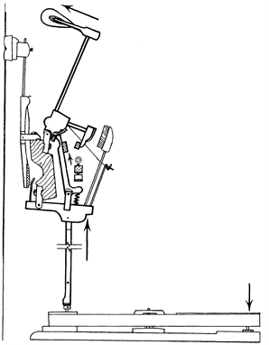
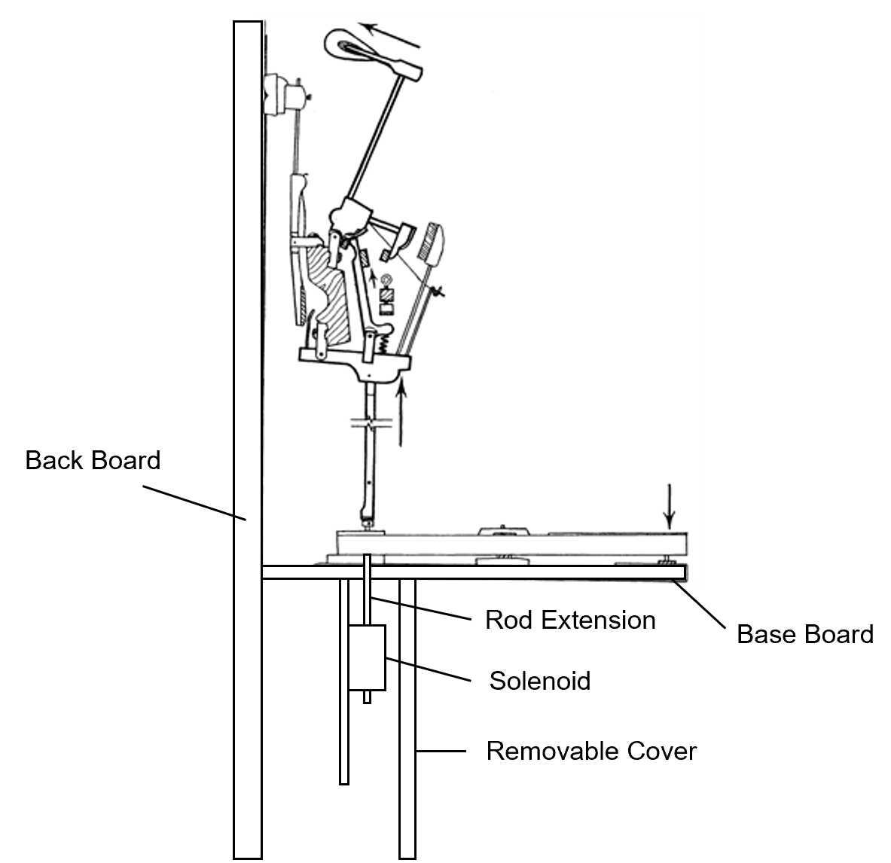
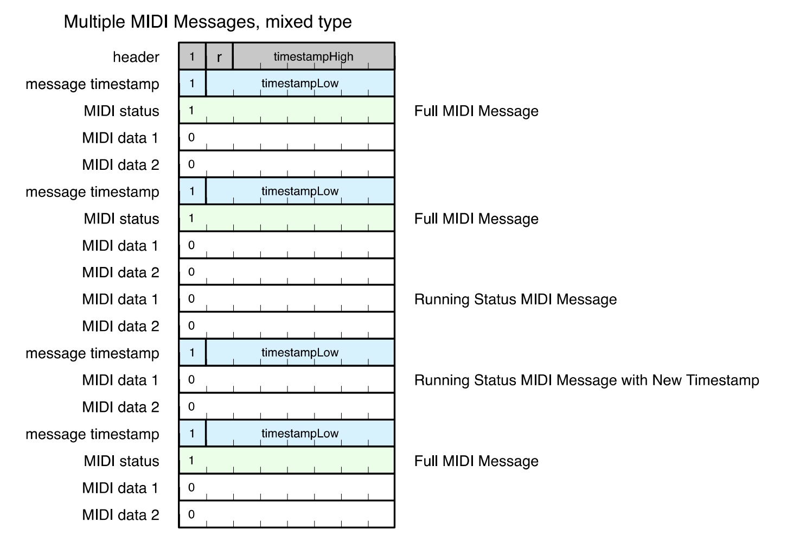

<iframe  width="560"  height="315"  src="https://www.youtube.com/embed/S7Bd992k368?si=Cdnbv742X09ewYGh"  title="YouTube video player"  frameborder="0"  allow="accelerometer; autoplay; clipboard-write; encrypted-media; gyroscope; picture-in-picture; web-share"  referrerpolicy="strict-origin-when-cross-origin"  allowfullscreen></iframe>

# Introduction

For a long time, self-playing pianos have inspired me — something about the way the keys move on their own is amazing. From this I found myself with a desire to create my own version of a self-playing piano at an affordable cost. My family had a rarely-used upright piano and an Arduino Uno that had been sitting in a drawer for years, and for the first time, I experimented with the two to see if I could make my idea a reality.

This desire grew into a six-month long personal project that resulted in the video artifact above and the creation of this repository. The first half of the video is a time-lapse of the entire build process, created from videos I took while working on the project. The second half of the video shows the project’s results. I accomplished every goal I had for the system by replicating any keystroke, maintaining the manual functionality of the piano, and reducing the cost of installing a self-playing piano system by 90%.

The purpose of this documentation is to serve as a technical specification for the system's features and design. Those interested in building their own systems or simply curious about the system's design will find this useful. You are free to clone this repository for personal use.

Those who are interested in building their own systems should also join the community [Discord server](https://discord.com/invite/reenxNyht5)! The server has over 500 members and is filled with other builders getting their own systems up and running.

# Features

-   Plays any song on the piano from a MIDI stream via a Bluetooth or USB connection, accurately reflecting its sound on the piano
-   Is recognized as a MIDI device from a Bluetooth or USB connection, enabling the user to stream MIDI files from a personal device in a plug-and-play fashion
-   Plays each note louder or softer depending on the MIDI’s velocity information
-   Maintains the manual functionality of the piano, even while the piano is playing
-   Includes control of the damper (sustain) pedal
-   Allows the user to turn the system on/off and access options via a control box on the front of the piano
-   Supports additional volume control via a dial on the control box
-   Maintains a discreet profile, hiding the electronics within the piano and only using a single power cord for the entire system.

# System Design

## Hardware

### Keys

Piano keys are designed as levers. When a piano player presses down on a key, the back side of the key in the piano's internals raises a mechanical device that hits the corresponding string with a hammer. 88 of these key levers are installed horizontally on the piano's base board, resulting in 88 keys. This is how all modern acoustic pianos are designed.

### Actuator Requirements

For a self-playing piano to work, each of the 88 keys must be individually moved by an actuator. Each actuator must:

-   Move linearly, corresponding to the linear push that plays a piano key
-   Be strong enough to push its key at a speed that loudly plays the note
-   Be power-efficient to enable 10+ keys (corresponding to 10+ fingers) to be played at once with a reasonably-sized power supply
-   Not get dangerously hot on a reasonable duty cycle of 10 seconds
-   Be small enough for all 88 of them to fit inside the piano

Because piano songs are written to be played with 10 fingers on a piano, 10 is chosen as the minimum number of keys that should be supported to be played simultaneously. However, because MIDI files are not limited to piano songs and can express their sound with 20 or even 30 notes at once, it is preferable that the system allows as many keys as possible to be played simultaneously.

Furthermore, 10 seconds is chosen as a reasonable duty cycle for the actuator because it takes approximately 10 seconds for the sound of a loudly played key to fade completely. MIDI files usually don’t hold notes for longer than this. If the MIDI file does not signal for a note to turn off after 10 seconds, the software will automatically turn its corresponding solenoid off.

### Choice & Installation

With these specifications and some testing, I decided on the JF-1039B solenoid, which can be purchased on AliExpress. The solenoid is rated at 24v 400mA, but during my testing, I found their actual power draw to be 750mA. With a few reasonable power supplies, up to 40 keys can be played at once. The solenoid has a force of 25N at its rated voltage, allowing it to push each key with sufficient power and speed. It takes 40 seconds to become unreasonably hot, which is significantly longer than the 10-second requirement. It is also small enough for all 88 of them to fit into two rows side by side, allowing them to be stored in a small space within the piano.

The solenoids can be installed to push down on the visible part of the key lever or up on the hidden part of the key lever inside the piano. To keep the system low-profile while maintaining the piano's manual functionality, I decided to mount the solenoids to push up on the invisible part of the key lever. This has the added benefit of allowing the visible part of the keys to move freely without visual interference from the electronics, giving the impression that the piano is actually playing itself.

The solenoids are arranged in two vertical rows on a thin mounting board. The mounting board is positioned beneath the invisible part of key levers, near the strings. A hole above each solenoid is drilled in the piano’s base board and a metal rod extension is mounted from each solenoid to its key, allowing each solenoid to push its key lever from under the piano. The vertical rows allow the entire mounting board to be hidden behind the removable board that covers the strings. A side view of a key with its solenoid is shown below.

### Damper Pedal

Each piano key has a damper piece that is designed to stop the string's vibration when the piano player releases the key, thereby ending the sound. The damper pedal, also known as the sustain pedal, turns off the damper piece on each piano key, allowing notes to play long after they are released and until their sound completely fades. The damper pedal, like the piano keys, is designed as a lever. It is controlled by the player's foot on the bottom of the piano, and a vertical rod carries the damper pedal's action up to the keyboard.

### Actuator Requirements

The damper pedal requires much more force to push than a key, but it only requires one actuator to work. The actuator for the damper pedal must:

-   Be strong enough to fully press the damper pedal, without a strong requirement for speed
-   Not get dangerously hot on a reasonable duty cycle of 120 seconds
-   Run on the same voltage as the keys

### Choice and Installation

During my research, I could not find a single solenoid that met all of these requirements while remaining affordable enough to be used for the project. However, since there isn’t a strict requirement on space for this actuator, the best solution turned out to be to connect two large solenoids in series to double the force that could be produced by a single solenoid. This also reduced the amperage required to power each solenoid due to Ohm's law.

After more research, I determined that the JF-1050B solenoid was a good fit for actuating the damper pedal and requested that two free units be included with my order of JF-1039B solenoids from the supplier. Once connected in series, these solenoids are powerful enough to push the damper pedal and require more than two minutes of continuous actuation to feel warm to the touch.

In the continued spirit of keeping the system low-profile, I mounted these solenoids to the internal part of the damper pedal lever where the user can’t see them. Like the keys, this has the added effect of making the pedal look as if it is moving on its own.

It should be noted that the actual installation of the damper pedal solenoids differs from what is shown in the video. In the video, I connected a single solenoid to the vertical rod that carries the damper lever’s action to the keyboard. This was my attempt at using a single solenoid to actuate the damper pedal. I quickly found that this solution lacked sufficient actuation distance to fully activate the damper's functionality. Later, I modified the installation to include two solenoids mounted to the lever part of the damper pedal, close to its fulcrum and pushing down on the piano’s bottom board, to increase the vertical distance the vertical rod moves.

### Other Pedals

There are two other pedals on a piano. The soft pedal alters the hammer action to hit the strings more softly, and the sostenuto pedal acts as the damper pedal but only for the notes that are being held down as the pedal is pressed. I decided not to include functionality for these two pedals when I was building the system because I was focused on getting the crucial parts of the system prototyped. If I were designing the system again, I would include these pedals. Since these two pedals are similar to the damper pedal, the damper pedal’s hardware and software can easily be copied to the soft and sostenuto pedals.

### Solenoid Control

For the solenoids to activate based on MIDI data, each key's solenoid must be controlled by an independent electrical signal via a microcontroller. Microcontrollers allow high-level logic to be programmed into electronics, creating the basis for solenoids to be controlled by code. A microcontroller is typically mounted on a development board that adds peripherals to it such as Bluetooth and WIFI connectivity, USB ports, output pins, and overload protection. Development boards make it easier to work with microcontrollers and create DIY projects like this one. To keep things simple, I use the terms microcontrollers and development boards interchangeably.

Because most microcontrollers are rated between 3.3-5v and our solenoids are rated at 24v, the microcontroller's signals must be amplified to 24v using a Darlington transistors to activate the solenoids. Many transistors will work for this as long as they can withstand the 24v load from the solenoids. I decided to use TIP120 NPN transistors. Furthermore, to support volume control, the microcontroller's electrical outputs should support [pulse-width modulation (PWM)](https://learn.sparkfun.com/tutorials/pulse-width-modulation/all), which controls the power of the solenoid and thus how hard it hits the key.

The number of keys on a piano and the requirement for distinct PWM signals for each one raises the issue of output limitations on microcontrollers. Almost no microcontroller has enough PWM outputs to map to all 88 keys on the piano. While it is possible to assign separate microcontrollers to control sets of 11 or so keys and communicate among them, this adds another layer of complexity to the electronics and inter-microcontroller communication. After consideration, the solution I chose was to expand the outputs of a single microcontroller to 88 using 74HC595 shift registers. 74HC595 shift registers convert three microcontroller pins into a virtually limitless number of output signals, with PWM support for each. The benefit of this approach is that it enables all solenoid actuation to be controlled by a single central microcontroller. Multiple microcontrollers are still used in the system, however, which is discussed more below.

The series of solenoids for the damper pedal also need to be controlled by an independent electrical signal via a microcontroller. This signal doesn’t need support for PWM because the damper pedal doesn’t have a requirement for speed. Technically, the damper pedal’s state in a MIDI file is a spectrum with a number indicating how pressed the damper pedal is. Most MIDI files don’t use this feature and simply set this number to its maximum to indicate that the damper pedal is pressed.

Additionally, because the damper pedal’s solenoids require so much power, a single transistor to step up the microcontroller’s voltage for them will quickly overheat. To address this, I connected [two transistors in parallel](https://www.homemade-circuits.com/transistor-facts/), effectively doubling the amount of power that a single transistor could handle.

### Microcontroller Design

With all of the considerations from the last section and research on the capabilities of different development boards on the market, I decided to divide the computation of the system into three parts: the MIDI Processor, Solenoid Actuator, and Control Box. Each of these parts is controlled by its own microcontroller, which communicates with the other parts of the system through a wired serial connection.

### 1. MIDI Processor (ESP32)

### Roles

-   Receives and decodes Bluetooth MIDI messages
-   Receives USB MIDI messages from the Control Box
-   Schedules key actuation based on MIDI messages
-   Messages actuation instructions to the solenoid actuator
-   Handles damper pedal scheduling and actuation
-   Receives and handles setting changes from the control box

### Commentary

The MIDI Processor is responsible for the majority of the system's computation. It receives MIDI messages from various sources and determines how and when to activate solenoids based on these messages.

To support the processing power required for this, I chose to use the ESP32 microcontroller, which has one of the fastest microcontroller processing speeds available on the market. It also has built-in Bluetooth capabilities, making it simple to integrate Bluetooth connectivity into the system.

### 2. Solenoid Actuator (ATmega32U4)

### Roles

-   Interfaces with the shift registers to send electrical signals to the solenoids
-   Receives and carries out actuation instructions from the MIDI Processor
-   Actuates keys based on USB MIDI messages from a debugging USB port

### Commentary

The Solenoid Actuator can be seen as a periphery of the MIDI Processor since its main purpose is to carry out solenoid actuation for it. Separating these tasks into a separate microcontroller has three main advantages:

1.  Outsourcing the task of actuation to another microcontroller reduces the computational load on the ESP32
2.  The ATmega32U4, unlike the ESP32, has library support to interface with the TX-34 shift registers
3.  The ATmega32U4, unlike the ESP32, has hardware and library support to be recognized as a MIDI device from a USB connection

Expanding on the third point, the ability to interact directly with the solenoids via USB MIDI signals is useful for performing maintenance tasks such as debugging or calibration. This is advantageous compared to forwarding MIDI signals through the MIDI Processor for debugging purposes because the serial communication required to forward the MIDI messages introduces another variable during debugging.

### 3. Control Box (ATmega32U4)

### Roles

-   Provides an on/off switch for the system
-   Provides an interface for changing settings within the system
-   Provides a dial for volume control
-   Provides a user-accessible USB port to receive MIDI messages that it forwards to the MIDI Processor

### Commentary

The Control Box is in a separate location from the rest of the system, so it makes sense to use a separate microcontroller for it. This allows the Control Box to have only a few wires connected to the main system:

1.  120v AC wires for the whole system connected to the on/off switch
2.  Positive and ground 5v DC wires to power the microcontroller
3.  A serial wire to communicate with the MIDI Processor

The Control Box, like the Solenoid Actuator, has a USB port that is recognized as a MIDI device by a connected computer. While the solenoid actuator uses the USB MIDI input to directly actuate the solenoids for debugging, the Control Box's USB MIDI input is routed to the MIDI Processor, where it is processed and scheduled for play.

The ATmega32U4 is the obvious choice of microcontroller for the Control Box for its USB MIDI capabilities.

The Control Box itself is built as a wooden box with a black finish. The display is a 16x2 liquid crystal display, and the buttons are basic electronic buttons that can be bought online. The box is mounted under the base board on the right side of the piano, beneath the visible part of the keys, ensuring user accessibility while keeping the system discreet.

### Powering the System

Each component in the system has its own rated voltage:

-   JF-1039B solenoids: 24V DC
-   JF-1050B solenoids: 24V DC
-   ESP32 microcontroller: 2.2-3.6V
-   ATmega32U4 microcontrollers: 2.7-5.5V
-   Shift registers, LEDs, etc: 3.3-5V

The challenge is to supply the appropriate amount of power to each of these components from a 120V AC wall socket. The solution is to divide the main power supply into two voltages: 3.3V DC for the microcontrollers and peripheral components and 24V DC for the solenoids. The microcontrollers and their components are powered by a MB102 breadboard power supply, while the solenoids are powered by two 24V 20A power supplies that can be found on AliExpress. The breadboard power supply is installed with the main electronics inside the piano, and its live and ground connections are connected to the control box microcontroller via a long wire.

## Software

### MIDI Messages and Inter-Microcontroller Communication

The MIDI Processor is tasked with processing MIDI streams and scheduling actuation steps based on that data. Actuation steps refer to the steps needed for a solenoid to play its key. The MIDI Processor can receive a MIDI stream from two sources:

1.  Bluetooth LE via a user’s personal device
2.  Serial via the Control Box

The individual messages from the MIDI stream needs to be decoded so its commands can be scheduled. The [MIDI protocol](https://drive.google.com/file/d/1QGjiK2QPPbii8YmES3vDEZlP63OGLiKr/view) is extensive, but the MIDI Processor is only concerned with commands to turn a note or the damper pedal on or off.

#### Bluetooth LE

The protocol for transmitting a MIDI stream over Bluetooth LE is specified in [https://www.hangar42.nl/wp-content/uploads/2017/10/BLE-MIDI-spec.pdf](https://www.hangar42.nl/wp-content/uploads/2017/10/BLE-MIDI-spec.pdf). MIDI over Bluetooth LE is packet-based, meaning multiple commands can be packed into a single message.

The first byte in the packet is a header that indicates the start of the message. It's followed by a timestamp byte. The remainder of the message is a series of commands composed of status bytes followed by data bytes. Status bytes indicate the type of command, such as whether a note is being turned on or off. The data bytes contain command-specific information, such as the note to turn on and its velocity. Multiple sets of data bytes can follow a single status byte, indicating that each set should be interpreted in the context of the last status byte. An example of a MIDI packet is shown below.

The full list of MIDI status bytes can be seen here: [https://midi.org/expanded-midi-1-0-messages-list](https://midi.org/expanded-midi-1-0-messages-list) and here: [https://midi.org/midi-1-0-control-change-messages](https://midi.org/midi-1-0-control-change-messages). As previously stated, the system is only concerned with the status bytes that correspond to a note or the damper pedal being turned on or off. We also are not concerned with which MIDI channel each command belongs to. Since the physical piano is the only channel in which the notes can be played, all 16 MIDI channels are aggregated and interpreted as a single channel. This results in the following table of important status bytes and their data:

| Command | Status Byte | Data Byte 1 | Data Byte 2 |
|---------|-------------|-------------|-------------|
| Note Off | 128-143 | 0-127 (Note Number) | 0-127 (Note Velocity) |
| Note On | 144-159 | 0-127 (Note Number) | 0-127 (Note Velocity) |
| Sustain Off | 176 | 64 | 0-63 |
| Sustain On | 176 | 64 | 64-127 |

Note that `Note Off` commands still have a note velocity in their data bytes. This can be ignored. Additionally, `Note On` commands could have a velocity of zero. This can be handled as if the command were `Note Off`. In other words, if the status byte is between 128 and 143 _or_ the note velocity is 0, the command is treated as a `Note Off` command.

Finally, the `Note Number` can range from 0 to 127, which is more notes than the piano's 88 keys. This is because MIDI files are not limited to the piano's 88 keys and can express higher or lower pitches than a standard acoustic piano. The MIDI protocol assigns a value of 21 to the lowest note on the piano and 106 to the highest note, and the MIDI Processor interprets those values accordingly.

#### Serial

MIDI messages received over serial originate from the Control Box over a wired MIDI connection.

As stated in previous sections, the ATMega32U4 used in the Control Box and Solenoid Actuator include hardware support to be recognized as a MIDI device over a USB connection. The [MIDIUSB](https://www.arduino.cc/reference/en/libraries/midiusb/) library allows a programmer to easily take advantage of these capabilities.

Each MIDI message parsed by the library consists of a header followed by three data bytes. Unlike MIDI messages sent over Bluetooth, each parsed message only contains one command and one set of data bytes per command. The important values of each message is listed below:

| Command | Header | Byte 1 | Byte 2 | Byte 3 |
|---------|-------------|-------------|-------------|--|
| Note Off | 8 | - | 0-127 (Note Number) | 0-127 (Note Velocity) |
| Note On | 9 | - | 0-127 (Note Number) | 0-127 (Note Velocity) |
| Sustain Off | 176 | 176 | - | 0-63 |
| Sustain On | 176 | 176 | - | 64-127 |

When the Control Box receives a MIDI message, it sends its command to the MIDI Processor over serial. The three microcontrollers in the system use the same universal protocol for transmitting messages over serial. Messages are made up of a header specifying the type of message, followed by the message's data. In the case of a note message, the data is the note number followed by the velocity of that note. The data of a sustain message contains only the message's status number (byte 3).

### Solenoid Model

Each solenoid is modeled in the MIDI Processor as being in one of several states corresponding to its place in the activation cycle. Each state is visited during the full cycle of playing a note and is followed in chronological order, looping back to the first state at the end of the cycle:

#### OFF

-   Refers to when the solenoid is not powered and in the deactivated position
-   Is the default state for the solenoid

#### ACTIVATION

-   Refers to when the solenoid has been powered, but has generated enough momentum to push its key yet
-   Is also referred to as the “startup” phase because the solenoid is generating force to move itself upward

#### VELOCITY

-   Refers to when the solenoid is actively moving the key during actuation
-   Is the critical stage where the velocity of the solenoid’s actuation will affect how loud the key plays

#### ON

-   Refers to when the solenoid is in its fully activated position and is no longer moving
-   Is when the key is being held down and its sound is being sustained

#### DEACTIVATION

-   Refers to when the solenoid has just been turned off and is falling back to its original position

It may be tempting to limit the solenoid to two states: ON when it receives power and OFF when it does not receive power. However, it is critical to distinguish between these different stages of the actuation cycle. First, the timing of when the solenoid begins each state influences the timing of future scheduling for that note. Furthermore, ACTIVATION, VELOCITY, and ON all have varying levels of PWM associated with their states. `ACTIVATION` corresponds to a PWM with 100% duty cycle due to the need for the solenoid to generate momentum. `VELOCITY` corresponds to a range of PWM cycles corresponding to the original MIDI message’s velocity information. Finally, `ON` corresponds to a PWM with a 100% duty cycle because it prevents the solenoids from making a subtle clicking noise when holding down the key. The solenoids tend to make a subtle clicking noise when held with a PWM under a duty cycle of 100%, and this clicking noise detracts from the sound of the strings.

### Note Scheduling Overview

The state of each solenoid is tracked by the MIDI Processor. When the MIDI Processor receives a MIDI message to play a note, it uses pre-calibrated values and the current time to determine exactly when the physical key will be fully pressed and when the solenoid should begin each of its states to reach that fully pressed state, down to the millisecond. These pre-calibrated values correspond to the expected time it takes for the solenoid to physically move from one state to another. Some of these pre-calibrated values include how long it takes a solenoid to generate momentum during its ACTIVATION stage and how long it takes for the solenoid to finish falling during its DEACTIVATION stage.

The MIDI Processor enters the calculated time to begin each state in a schedule for that solenoid. The MIDI Processor constantly checks the schedule of all 88 solenoids in its main execution loop. For each solenoid’s schedule, it compares the current time to the time of each entry in the schedule. If the current time equals or exceeds the time in one of the entries, the solenoid will send a signal to the Solenoid Actuator to initiate that state for the solenoid. It also removes that entry from the schedule indicating that the state has been reached.

For example, if the current time is `100052`, a solenoid is in its `ON` state and the schedule specifies that the solenoid should move into its `DEACTIVATION` state at `100054`, the ESP32 will do nothing and continue its schedule checking. However, if in the next schedule check the time is `100056`, the ESP32 will remove the `DEACTIVATION` entry from the solenoid’s schedule and send a signal to the Solenoid Actuator to move that solenoid into `DEACTIVATION` (by turning the solenoid off).

### Advanced Note Scheduling

There are numerous cases that need to be taken into consideration when scheduling a solenoid’s actuation. For example, what if a MIDI file sends a `Note On` command while the note is already `ON` and is not scheduled to turn `OFF`? Remember that MIDI files don’t conform to the physical limitations of a piano, so it’s completely reasonable for a MIDI file to overlap a note on top of itself. The system is expected to replicate this sound despite the overlap. There are also cases where the bounciness of a piano key can be used to the solenoid’s advantage to play a note repeatedly fast.

#### Universal Key Delay

The MIDI Processor maintains a universal key delay that corresponds to the theoretical maximum amount of time it might take for a solenoid to reach to its `ON` state after the system receives a `Note On` command from a MIDI source. This delay is calculated by considering the case when the solenoid is in its `ON` state, is not scheduled to turn `OFF`, and another `Note On` command for that key is received from a MIDI source. To play the key again, the solenoid has to transition into `DEACTIVATION`, `OFF` (for a brief moment), `ACTIVATION`, `VELOCITY`, and finally back to `ON`. The sum of the time it takes for a solenoid to transition through all of these states is the theoretical maximum amount of time it could take for the solenoid to reach its `ON` state.

To use this delay, the scheduling system first schedules the final state of the solenoid (`ON` if the command is `Note On` or `OFF` if the command is `Note Off`) to happen after this delay, and then schedules the rest of the actuation steps backwards from that final state. By first scheduling the final state of the solenoid based on this delay and doing this for every MIDI command, the sound of the piano is synced among all keys no matter what state a solenoid is in when a MIDI command for it is received.

This scheduling delay also creates the possibility that a solenoid could have more than one actuation cycle scheduled in the future. Consider the case of the MIDI Processor receiving MIDI messages for a note played twice quickly (`Note On` and `Note Off` followed by a second `Note On` and `Note Off` in quick succession). The MIDI Processor will schedule the first actuation cycle on its own. However, when the second `Note On` and `Note Off` commands are received, the solenoid might still be in any one of its states in the first cycle, meaning that existing entries will still exist in the schedule for the remaining states in that cycle. To schedule the second actuation cycle, the MIDI Processor appends a second entry for each state in the solenoid’s schedule. When its schedule is checked, the MIDI Processor will only look at the least recent entry for that state in the schedule.

#### Scheduling Cases

There are four cases that must be considered when a MIDI command is received:

1.  A `Note On` command is received and the scheduling required for that solenoid to reach its `ON` state after the universal delay does not overlap with any existing scheduling
    
    In this case, the MIDI Processor can schedule the solenoid’s activation steps without any hassle. It simply appends in the solenoid’s schedule the time entry for each state leading up to and including the `ON` state.
    
    This can be split into two sub-cases based on the solenoid’s existing schedule:
    
    1.  The solenoid is either in its `OFF` state or the final entry in the existing schedule is for the solenoid to be in its `OFF` state
        
        In this sub-case, the MIDI Processor only appends in the solenoid’s schedule the time entries for the `ACTIVATION`, `VELOCITY`, and `ON` states.
        
    2.  The solenoid is either in its `ON` state or the final entry in the existing schedule is for the solenoid to be in its `ON` state
        
        In this sub-case, in addition to scheduling the solenoid’s `ACTIVATION`, `VELOCITY`, and `ON` states, the MIDI Processor also schedules the solenoid’s `DEACTIVATION` and `OFF` states. Since the solenoid is only `OFF` for a brief moment, the `OFF` and `ACTIVATION` entries have the same value.
        
2.  A `Note Off` command is received and the target time for that solenoid to reach its `OFF` state after the universal delay does not overlap with any existing scheduling
    
    In this case, the MIDI Processor can schedule the solenoid’s deactivation steps without any hassle. It simply appends in the schedule the time entry for the `DEACTIVATION` and `OFF` states.
    
    This can be split into two sub-cases based on the solenoid’s existing schedule:
    
    1.  The solenoid is either in its `ON` state or the final entry in the existing schedule is for the solenoid to be in its `ON` state
        
        In this sub-case, the MIDI Processor appends in the solenoid’s schedule the time entries for the `DEACTIVATION` and `OFF` states.
        
    2.  The solenoid is either in its `OFF` state or the final entry in thee existing schedule is for the solenoid to be in its `OFF` state
        
        In this sub-case, the solenoid is already `OFF` or is scheduled to be `OFF`, so no entries are added to the schedule.
        
3.  A `Note On` command is received and the target time for that solenoid to reach its `ON` state and its prior activation states overlaps with existing time(s) in the schedule
    
    This is where scheduling gets complicated, because the system is expected to replicate the sound of a MIDI file when the MIDI file isn’t designed to do so. To schedule the command to play, the MIDI Processor either modifies the existing schedule of the solenoid in a way that doesn’t affect the sound of the piano or determine that the note cannot be played at all.
    
    This can be split into multiple sub-cases based on the schedule for the solenoid. These sub-cases are checked in order:
    
    1.  The solenoid is either in its `ON` state or is scheduled to be in its `ON` state at some future point, the final entry in the solenoid’s existing schedule is for it to be in its `OFF` state, and the time that the solenoid would need to begin its `DEACTIVATION` state to schedule the new `Note On` command is after the solenoid is scheduled to be in its `ON` state but before the solenoid is scheduled to begin its `DEACTIVATION` state.
        
        In this case, the solenoid is scheduled to turn `OFF`, but the time it is scheduled to begin its `DEACTIVATION` state is later than what would be required for the incoming `Note On` command to be scheduled. And importantly, the time that would be required for the solenoid to begin its `DEACTIVATION` state is _after_ the note is scheduled to be in its `ON` state.
        
        The simple solution is to alter the previously scheduled `DEACTIVATION` and `OFF` states to conform to the requirements of the incoming `Note On` command. This does not impact the sound of the piano significantly enough to stray from the intended sound of the MIDI file. Therefore, the MIDI Processor alters the previously scheduled `DEACTIVATION` and `OFF` entries to conform to the new times that are required to schedule the incoming `Note On` command. It then appends `ACTIVATION`, `VELOCITY`, and `ON` entries to the schedule to complete its scheduling.
        
    2.  The solenoid is scheduled to be in its `ON` state at some future point, but the time that the solenoid would need to begin its `DEACTIVATION` state to schedule the new `Note On` command is before the solenoid is scheduled to reach its `ON` state
        
        In this case, the solenoid is scheduled to be in its `ON` state, but for the incoming `Note On` command to be scheduled, the `DEACTIVATION` state would have to begin before the note reaches that `ON` state.
        
        At first, this case seems impossible to schedule since it doesn’t logically make sense to begin deactivating a key before it is even played. However, the unique ability of piano keys to bounce after being played allows the MIDI Processor to schedule this case. The bounciness of a piano key refers to the momentum that is transferred to the key’s deactivation cycle when the key is let go immediately after it is pressed. This decreases the time it takes to deactivate a key and allows pianists to play keys in fast succession, which is a technique commonly used in piano songs.
        
        The MIDI Processor can attempt to use this feature to schedule the `Note On` command despite the timing conflict. It maintains an additional pre-calibrated value that corresponds to the time it takes for a solenoid to complete its `DEACTIVATION` state when the bounciness of the key speeds up its downward movement. This time is much less than the usual time it takes for a key to complete its `DEACTIVATION` state. If, with the quick `DEACTIVATION` time, the solenoid can reach its `OFF` state before the solenoid would have to begin its `ACTIVATION` state to schedule the incoming `Note On`command, the MIDI Processor can schedule the `Note On` using the key’s bounciness.
        
        To do this, MIDI Processor schedules the solenoid’s `DEACTIVATION` state to begin immediately when the solenoid reaches its scheduled `ON` state. Then, the MIDI Processor schedules the solenoid’s `OFF` state after the quick `DEACTIVATION` time. From there, the MIDI Processor schedules the solenoid’s `ACTIVATION`, `VELOCITY`, and `ON` states in accordance with the target time for the solenoid to reach its new `ON` state.
        
    3.  None of the previous cases apply
        
        If none of the previous cases apply, the solenoid cannot be scheduled without affecting the sound of previously scheduled notes, so the command is ignored.
        
4.  A `Note Off` command is received and the target time for that solenoid to reach its `OFF` state and the time it would need to begin its prior `DEACTIVATION` state overlaps with existing time(s) in the schedule
    
    Similar to the previous case, the MIDI Processor can either re-schedule existing `DEACTIVATION` and `OFF` entries or use the bounciness of the key to reach its `OFF` state in a faster time.
    
    In the case where the command can’t be scheduled in time, it’s still important for the key to stop playing and the solenoid to turn off. The MIDI Processor would therefore schedule the solenoid to turn off as soon as possible, even if the timing doesn’t conform the the universal key delay.
    

### Damper Pedal Scheduling

The scheduling for the damper pedal solenoids is implemented similarly to the scheduling for the key solenoids, with the exception that there is no `VELOCITY` state due to there being no use for it. `Sustain On` and `Sustain Off` commands conform to the same universal key delay that the notes do, ensuring that the entire piano is synchronized.

### Additional Scheduling Logic

#### Velocity Value Entries

Recall that the `VELOCITY` state of the solenoid is during the critical point where the PWM of the solenoid affects how loud the key plays. Each `VELOCITY` state therefore has an associated velocity value entry with the velocity data from the original MIDI command. When the MIDI Processor sends a signal to the Solenoid Actuator when the `VELOCITY` state is reached in the schedule, it includes that velocity value in the message. The Solenoid Actuator uses a pre-calibrated equation to transform the velocity value into a PWM value that it activates the solenoid with. This equation was developed from trial and error and how loud the piano was with different PWM values.

#### Power Supply Management

The MIDI Processor maintains the count of solenoids the that are receiving power by each power supply. Recall that the power supplies can only support a limited number of solenoids being powered at the same time. If the MIDI Processor detects that scheduling a note on command would overload one of the power supplies, it ignores the command. This also takes the damper pedal solenoids into consideration.

#### Number of Note Instances

Recall that MIDI files are able to stack multiple instances of the same note on top of itself. In other words, the MIDI Processor might receive two or more note on commands followed by two or more note off commands for a single note. Without considering this in scheduling, the MIDI Processor would receive the first note off command, schedule it to turn off the solenoid, and ignore the subsequent note off command. This is undesirable because technically, in the MIDI file, the note is still playing after the first note is turned off. The MIDI Processor therefore only schedules the solenoid to turn off when the last instance of the note turns off.

For each note, the MIDI Processor keeps track of how many instances of the note there are with a counter that increases when a `Note On` command is received and decreases when a `Note Off` command is received. When the note has more than one instance left and a `Note Off` command is received, the counter is decreased, but the command isn’t scheduled. When the note is in its last instance and a `Note Off` command is received, the counter goes to zero and the command is scheduled. This further ensures that the piano accurately reflects the sound of the MIDI file.

#### Automatic Solenoid Turn-off

Recall that the sound of a key only lasts about 10 seconds and the solenoids have a limited duty cycle until they get too hot. To avoid the solenoids from overheating, it’s important to turn off the solenoids when the key is no longer sounding. The scheduler enforces this by comparing its time to the last `ON` entry in each solenoid’s schedule if the solenoid is in its `ON` state. If the solenoid reached its `ON` state more than 10 seconds before the current time, the MIDI Processor automatically schedules the solenoid to turn off.

### Control Box Logic

The control box provides an interface for changing settings within the system, a dial for volume control, and a reset button in the case of a problem.

#### Storing and Transmitting Settings

Here are some examples of settings that can be adjusted with the control box:

-   The pre-calibrated time values used for scheduling
-   The number of solenoids that each power supply can support
-   The time threshold to automatically turn off solenoids

The control box has four buttons. The left and right buttons navigate to different settings on the user interface, while the up and down buttons change the value of the selected setting. Each time a setting is changed, the Control Box sends a message to the MIDI Processor with the setting’s new value. This message is sent with same inter-microcontroller protocol discussed above, and its header indicates that the message specifies a setting change. In addition to sending the message, the Control Box saves the setting’s new value in its EEPROM, preserving the value across sessions.

When the system is powered on, the Control Box reads each setting’s value from its EEPROM and sends them each to the MIDI Processor. The MIDI Processor blocks until it receives these messages from the Control Box. Once the settings are received, the MIDI Processor is initialized and ready to accept MIDI input.

#### Volume Control

Volume control is read as an analog signal from the control box’s potentiometer. Due to natural noise within this reading, the volume is only registered as a change when the reading changes by more than a few points. With each change to the volume control, the Control Box sends a message to the MIDI Processor with the new volume. For each incoming `Note On` message, the MIDI Processor then transforms its velocity by a factor of the last volume setting received by the Control Box.